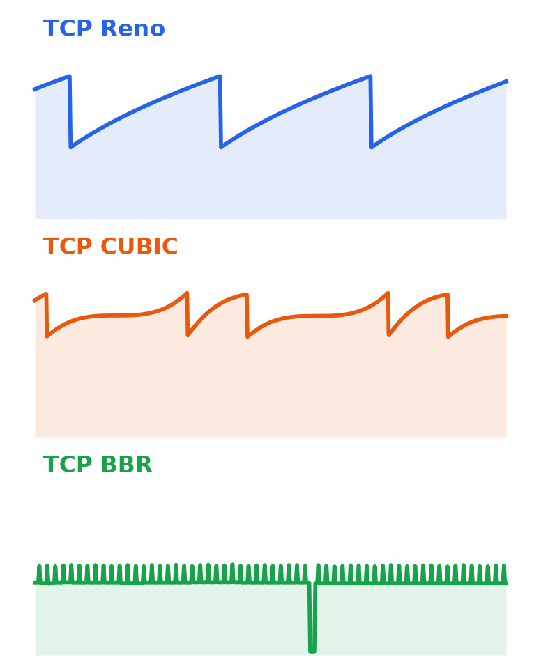
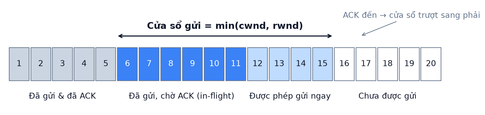
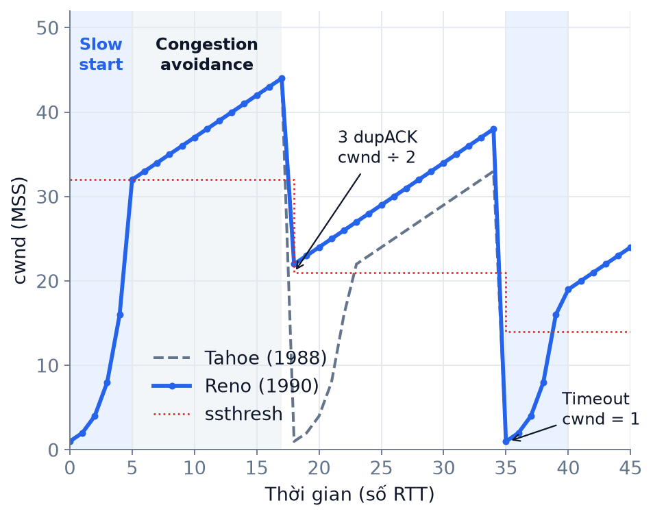
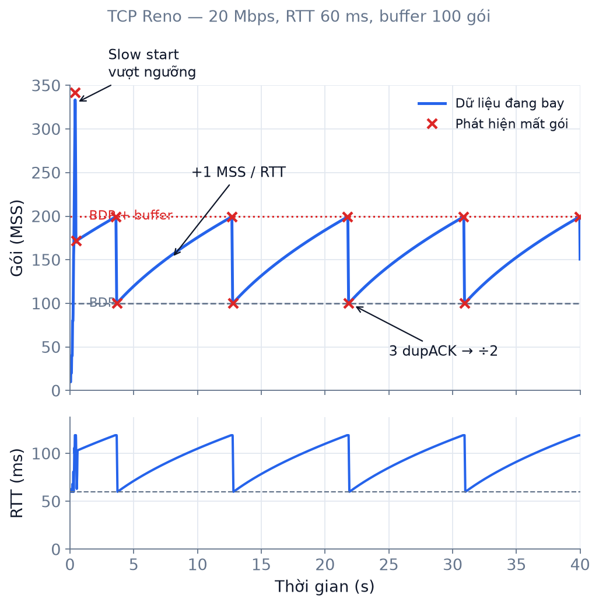
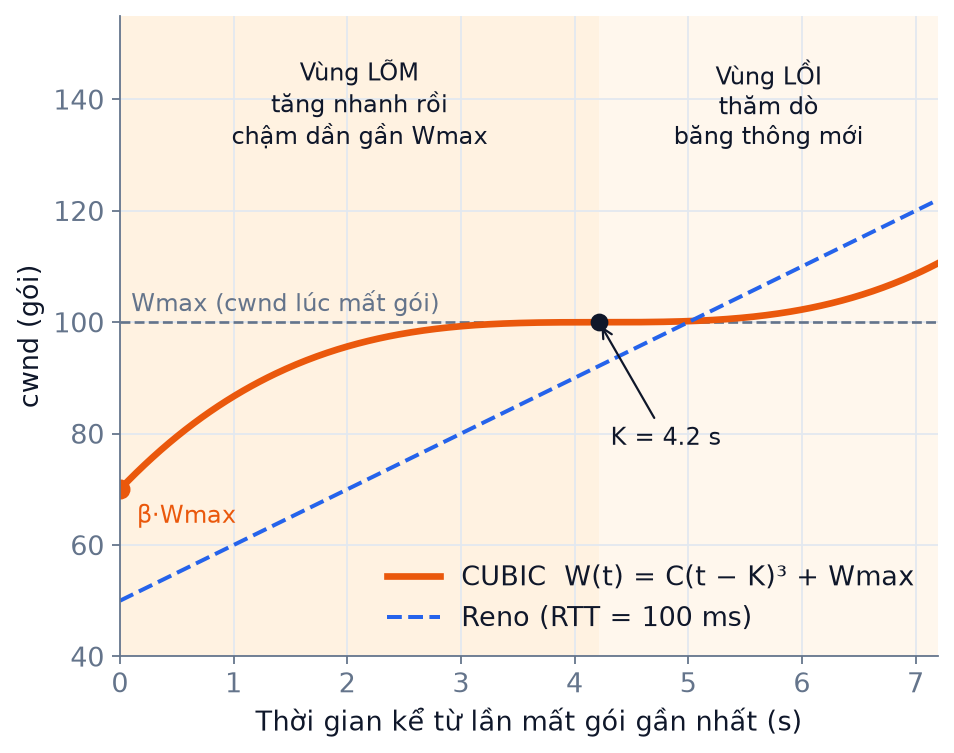
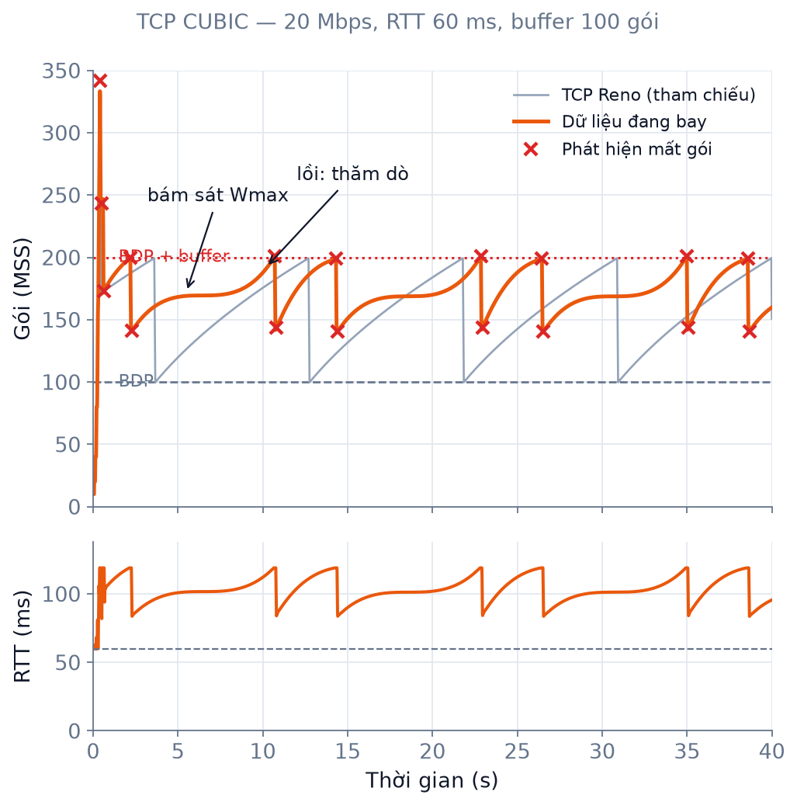
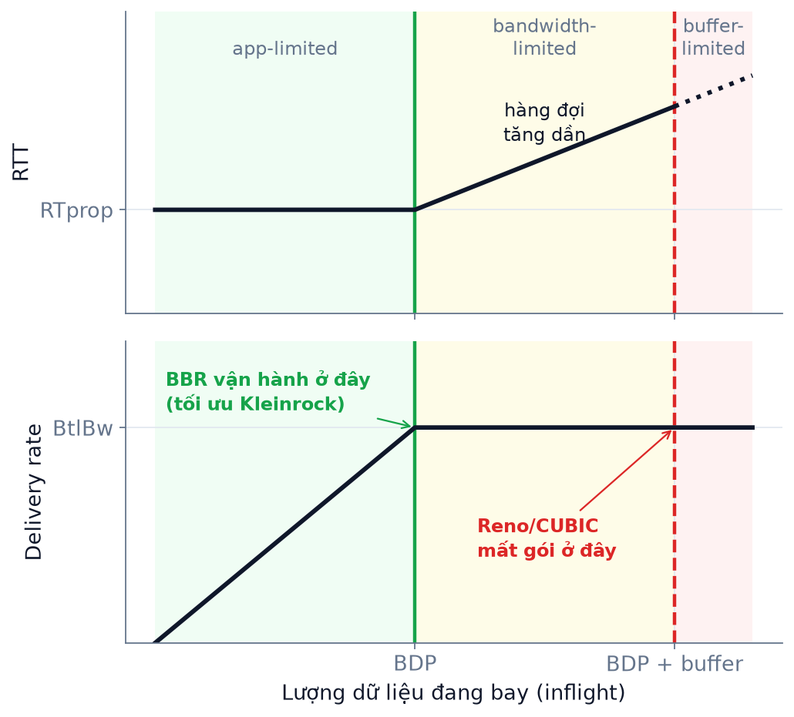
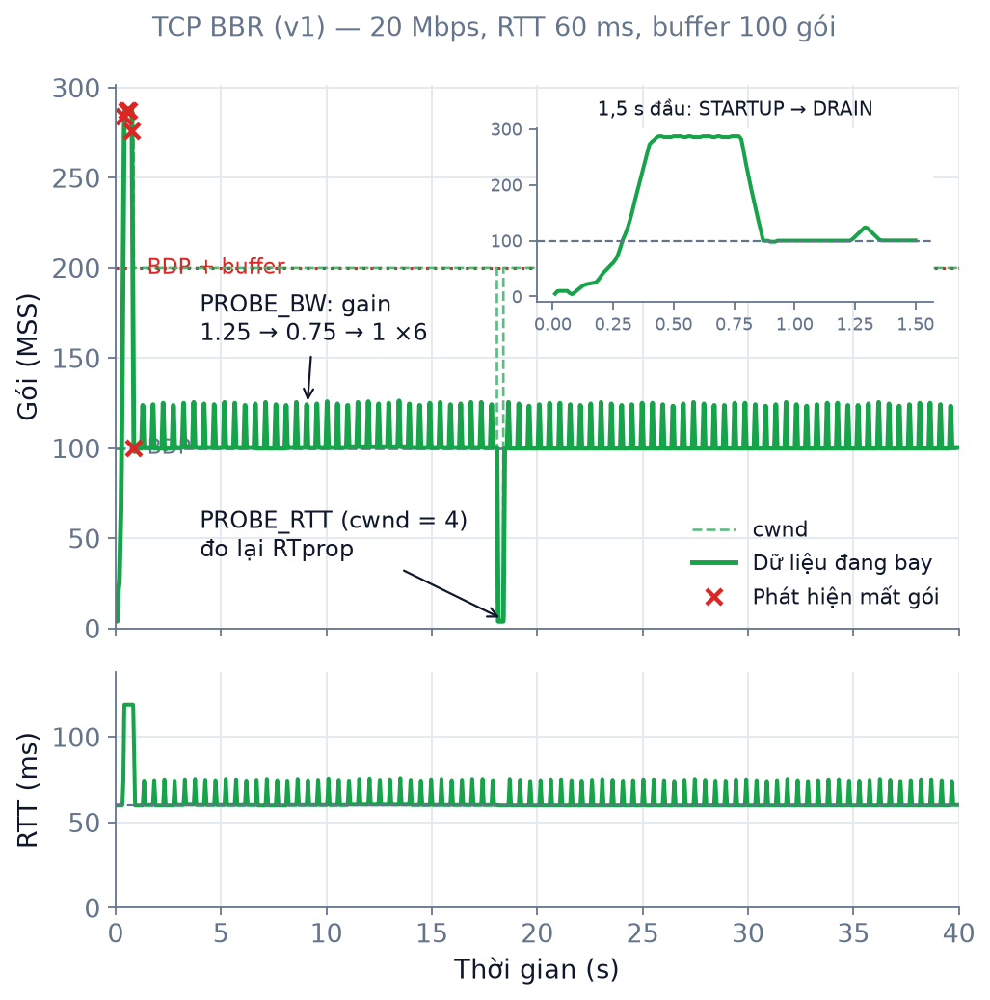
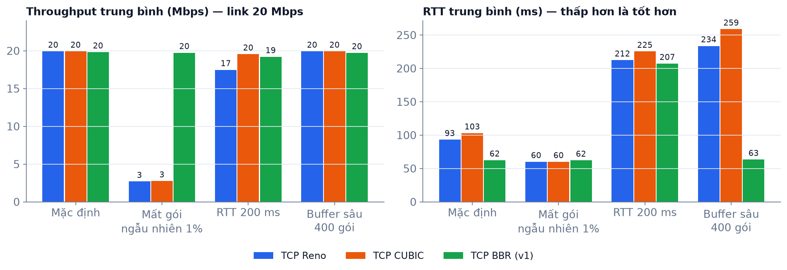

<!-- _class: title -->
<!-- _paginate: false -->

# Thuật toán kiểm soát<br>tắc nghẽn TCP

## Reno · CUBIC · BBR — mô phỏng bằng Python

**T28** — TCP Congestion Control Algorithms Implementation
Window management · Mô phỏng tắc nghẽn · Tối ưu hiệu năng TCP



<!--
[~0:20]
Xin chào thầy cô và các bạn. Đề tài của nhóm em là T28: cài đặt và mô phỏng các thuật toán kiểm soát tắc nghẽn của TCP.

Bên phải là ba đường đồ thị mà lát nữa các bạn sẽ thấy chạy trực tiếp: cùng một đường truyền, nhưng ba thuật toán Reno, CUBIC và BBR lại "lái" dữ liệu theo ba cách rất khác nhau. Mục tiêu của bài là hiểu vì sao lại như vậy.
-->

---

<!-- _class: center -->

## Nội dung

1. **Window Management** — nền tảng điều khiển luồng dữ liệu của TCP
2. **TCP Reno** (1990) — AIMD kinh điển, phản ứng theo mất gói
3. **TCP CUBIC** (2005) — tăng trưởng theo hàm bậc ba, mặc định trên Linux
4. **TCP BBR** (2016) — dựa trên mô hình băng thông & độ trễ của Google
5. **Live demo** — mô phỏng tắc nghẽn thời gian thực

<!--
[~0:20]
Bài trình bày gồm bốn phần chính. Đầu tiên là khái niệm cửa sổ, vì cả ba thuật toán đều xoay quanh việc điều chỉnh một con số: cửa sổ tắc nghẽn. Sau đó là ba thuật toán theo thứ tự lịch sử: Reno, CUBIC và BBR. Với mỗi thuật toán, em sẽ nói về lịch sử, ý tưởng, công thức, đồ thị truyền tải và ưu nhược điểm. Cuối cùng là phần demo trực tiếp.
-->

---

<!-- header: '01 · Window Management' -->

## Vì sao cần kiểm soát tắc nghẽn?

- **10/1986 — "congestion collapse"**: đường truyền LBL ↔ UC Berkeley tụt từ **32 kbps xuống 40 bps** (giảm ~1000 lần)
- Nguyên nhân: bên gửi **không biết mạng chịu được bao nhiêu** → gửi dồn, mất gói, gửi lại… càng nghẽn thêm
- Giải pháp (Van Jacobson, 1988): mỗi bên gửi tự giới hạn lượng dữ liệu đang "bay" trên mạng bằng một **cửa sổ trượt**



<!--
[~0:40]
Tại sao phải kiểm soát tắc nghẽn? Năm 1986, Internet gặp sự cố gọi là "congestion collapse": đường truyền giữa phòng thí nghiệm Lawrence Berkeley và đại học Berkeley, chỉ cách nhau khoảng 400 mét, tụt từ 32 kilobit xuống còn 40 bit mỗi giây, tức gần một nghìn lần.

Lý do là các máy gửi không biết mạng chịu tải được bao nhiêu. Chúng gửi dồn, router tràn bộ đệm, gói bị mất, rồi chúng lại gửi lại, làm mạng càng nghẽn hơn.

Van Jacobson đề xuất: mỗi bên gửi chỉ được phép có một lượng dữ liệu nhất định đang trên đường truyền, đó là cửa sổ trượt như hình. Phần màu xanh đậm là dữ liệu đã gửi nhưng chưa được xác nhận. Mỗi khi ACK về, cửa sổ trượt sang phải và ta được gửi thêm.
-->

---

## Hai cửa sổ và "cái ống" BDP

- **rwnd** (receiver window) — bên nhận báo còn bao nhiêu chỗ → *flow control*
- **cwnd** (congestion window) — bên gửi **tự ước lượng** sức chứa của mạng → *congestion control*

$$
W_{send} = \min(cwnd,\ rwnd) \qquad\quad Throughput \approx \frac{cwnd}{RTT}
$$

$$
BDP = Bandwidth \times RTT_{min} \qquad \text{VD: } 100\ \text{Mbps} \times 50\ \text{ms} = 625\ \text{KB} \approx 417\ \text{gói}
$$

- $cwnd < BDP$ → **lãng phí** băng thông
- $BDP < cwnd < BDP + buffer$ → dư thừa nằm trong hàng đợi router → **tăng độ trễ**
- $cwnd > BDP + buffer$ → **tràn buffer, mất gói**

<!--
[~0:45]
TCP có hai cửa sổ. rwnd do bên nhận quảng bá, để không làm tràn bộ nhớ bên nhận; đó là flow control. Còn cwnd do bên gửi tự ước lượng, để không làm tràn mạng; đó là congestion control, chủ đề hôm nay. Lượng thực sự được gửi là giá trị nhỏ hơn trong hai cửa sổ, và throughput xấp xỉ bằng cwnd chia RTT.

Khái niệm quan trọng nhất là BDP, tích băng thông nhân độ trễ, tức "dung tích của cái ống". Ví dụ đường 100 Mbps, RTT 50 ms thì ống chứa khoảng 417 gói.

Nếu cwnd nhỏ hơn BDP, ta lãng phí đường truyền. Lớn hơn BDP, phần dư nằm chờ trong buffer router làm tăng độ trễ. Lớn hơn cả BDP cộng buffer thì tràn, mất gói. Mọi thuật toán đều cố tìm cwnd "vừa đủ".
-->

---

## Các pha điều khiển cửa sổ

- **Slow start**: +1 MSS mỗi ACK → cwnd **×2 mỗi RTT**, đến ngưỡng `ssthresh`
- **Congestion avoidance**: **+1 MSS mỗi RTT** (tăng tuyến tính)
- Tín hiệu tắc nghẽn:
  - **3 duplicate ACK** → mất gói nhẹ
  - **Timeout (RTO)** → nghiêm trọng, cwnd = 1
- **AIMD** — *Additive Increase, Multiplicative Decrease*: hội tụ về chia sẻ công bằng (Chiu & Jain, 1989)



<!--
[~0:40]
Cửa sổ thay đổi theo các pha như hình bên phải. Ban đầu là slow start: mỗi ACK tăng cwnd thêm một gói, nên cứ mỗi RTT cwnd gấp đôi, tăng theo hàm mũ đến ngưỡng ssthresh. Sau đó chuyển sang congestion avoidance, mỗi RTT chỉ tăng thêm một gói.

TCP coi mất gói là dấu hiệu tắc nghẽn. Nhận ba ACK trùng nghĩa là một gói bị mất nhưng các gói sau vẫn tới, tức mạng chỉ nghẽn nhẹ. Còn timeout nghĩa là không nhận được gì, rất nghiêm trọng, nên cwnd về 1.

Nguyên lý chung là AIMD: tăng cộng, giảm nhân. Chiu và Jain đã chứng minh cơ chế này giúp nhiều luồng hội tụ về chia sẻ băng thông công bằng.
-->

---

<!-- header: '02 · TCP Reno' -->
<!-- _class: reno -->

## TCP Reno — tổng quan

- **Ra mắt:** 1990, trong hệ điều hành **4.3BSD-Reno**; tiền thân là Tahoe (1988)
- **Tác giả:** **Van Jacobson** (Lawrence Berkeley Lab) & **Michael J. Karels** (UC Berkeley)
- **Chuẩn hoá:** RFC 2001 (1997) → RFC 5681 (2009)
- **Phiên bản mới nhất:** **NewReno — RFC 6582 (2012)**; QUIC (RFC 9002, 2021) cũng dùng bộ điều khiển kiểu NewReno

### Mục tiêu so với Tahoe
- Tahoe: *mọi* lần mất gói → cwnd = 1, slow start lại từ đầu → "ống" bị rút cạn
- Reno thêm **Fast Retransmit + Fast Recovery**: 3 dupACK nghĩa là mạng vẫn chuyển được gói → gửi lại ngay, **chỉ giảm một nửa** cwnd

<!--
[~0:35]
Thuật toán đầu tiên là TCP Reno, ra đời năm 1990 trong bản 4.3BSD-Reno, do Van Jacobson và Michael Karels phát triển. Nó được chuẩn hoá trong RFC 2001, sau đó là RFC 5681. Phiên bản mới nhất là NewReno, RFC 6582 năm 2012; ngay cả giao thức QUIC hiện đại cũng dùng một bộ điều khiển kiểu NewReno làm mặc định.

Reno cải tiến từ Tahoe. Tahoe cứ mất gói là đưa cwnd về 1 và slow start lại, rất lãng phí. Reno nhận ra rằng ba ACK trùng nghĩa là mạng vẫn đang chuyển gói, nên nó gửi lại gói mất ngay lập tức và chỉ giảm cwnd một nửa. Đó là fast retransmit và fast recovery.
-->

---

<!-- _class: reno -->

## Reno — ý tưởng & công thức

**Ý tưởng:** tăng dần để *thăm dò* băng thông cho đến khi mất gói, rồi giảm một nửa → đồ thị **răng cưa**

| Sự kiện | Cập nhật |
|---|---|
| Mỗi ACK (slow start) | $cwnd \leftarrow cwnd + 1$ |
| Mỗi ACK (congestion avoidance) | $cwnd \leftarrow cwnd + \dfrac{1}{cwnd}$ &nbsp;(≈ +1 MSS/RTT) |
| 3 duplicate ACK | $ssthresh = \dfrac{cwnd}{2},\ \ cwnd = ssthresh$ |
| Timeout (RTO) | $ssthresh = \dfrac{cwnd}{2},\ \ cwnd = 1$ |

**Mô hình Mathis (1997)** — throughput khi tỉ lệ mất gói là $p$:

$$
Throughput \approx \frac{MSS}{RTT}\cdot\frac{1.22}{\sqrt{p}}
$$

<!--
[~0:40]
Ý tưởng của Reno rất đơn giản: cứ tăng dần để thăm dò xem mạng chịu được bao nhiêu, đến khi mất gói thì giảm một nửa. Vì vậy đồ thị của Reno có dạng răng cưa.

Bảng này là toàn bộ thuật toán. Mỗi ACK trong slow start cộng một gói. Trong congestion avoidance, mỗi ACK cộng một phần cwnd, cộng dồn lại thành một gói mỗi RTT. Ba ACK trùng thì cwnd chia đôi, timeout thì về 1.

Công thức Mathis rút ra từ hành vi đó: throughput tỉ lệ nghịch với RTT và với căn bậc hai của tỉ lệ mất gói. Hai hệ quả quan trọng: RTT càng dài càng chậm, và chỉ cần mất gói một chút là throughput giảm rất mạnh.
-->

---

<!-- _class: reno small -->

## Reno — đồ thị truyền tải

### ✓ Ưu điểm
- Đơn giản, ổn định, dễ phân tích
- Công bằng giữa các luồng **cùng RTT**
- Là chuẩn tham chiếu "TCP-friendly" cho mọi thuật toán sau

### ✗ Nhược điểm
- **Quá chậm trên mạng BDP lớn**: 10 Gbps, RTT 100 ms cần cwnd ≈ 83.333 gói; sau 1 lần mất gói phải mất **~70 phút** mới tăng lại (RFC 3649)
- Bất công theo RTT: throughput ∝ 1/RTT
- Nhầm **mất gói ngẫu nhiên** (Wi-Fi, 4G) là tắc nghẽn
- Luôn lấp đầy buffer → **bufferbloat** (RTT 60 → 120 ms)



<!--
[~0:45]
Đây là đồ thị do chính mô phỏng của nhóm tạo ra: đường 20 Mbps, RTT 60 ms, buffer 100 gói. Đầu tiên slow start vọt lên quá ngưỡng, sau đó là răng cưa đều đặn: tăng chậm từ BDP lên BDP cộng buffer, mất gói, chia đôi. Đồ thị RTT phía dưới cho thấy buffer bị lấp đầy liên tục, độ trễ tăng gấp đôi.

Ưu điểm của Reno là đơn giản, ổn định, công bằng nếu các luồng có cùng RTT, và là chuẩn tham chiếu cho mọi thuật toán sau này.

Nhưng nhược điểm rất lớn trên mạng hiện đại. Với đường 10 Gbps, RTT 100 ms, sau một lần mất gói Reno cần khoảng 70 phút mới lấy lại tốc độ. Nó còn bất công với luồng có RTT dài, và hiểu nhầm mất gói do nhiễu sóng Wi-Fi là tắc nghẽn.
-->

---

<!-- header: '03 · TCP CUBIC' -->
<!-- _class: cubic -->

## TCP CUBIC — tổng quan

- **Ra mắt:** **2005** (PFLDnet 2005; ACM SIGOPS OSR 2008)
- **Tác giả:** **Injong Rhee, Lisong Xu, Sangtae Ha** — NC State University; kế thừa **BIC-TCP** (2004) của cùng nhóm
- **Triển khai:** mặc định trên **Linux từ 2.6.19 (2006)**, **Windows 10 1709+ / Server 2019+**, macOS/iOS
- **Chuẩn hoá:** RFC 8312 (2018) → **RFC 9438 (08/2023, Standards Track)** — phiên bản mới nhất

### Mục tiêu so với Reno
- Tận dụng nhanh các mạng **BDP lớn** (*long fat networks*)
- Tốc độ tăng cwnd **không phụ thuộc RTT** → công bằng hơn giữa các luồng
- Vẫn **thân thiện với Reno** trên mạng nhỏ (vùng *Reno-friendly*)

<!--
[~0:35]
Để khắc phục điểm yếu của Reno trên mạng tốc độ cao, năm 2005 nhóm của Injong Rhee, Lisong Xu và Sangtae Ha ở đại học NC State công bố CUBIC, kế thừa từ BIC-TCP của chính nhóm này.

CUBIC thành công đến mức trở thành mặc định trên Linux từ năm 2006, trên Windows 10 từ bản 1709 và trên macOS. Nó được chuẩn hoá chính thức trong RFC 9438 vào tháng 8 năm 2023.

Mục tiêu của CUBIC có ba ý: tăng tốc nhanh trên mạng có BDP lớn, tốc độ tăng không phụ thuộc RTT để công bằng hơn, và vẫn không lấn át Reno trên các mạng nhỏ.
-->

---

<!-- _class: cubic -->

## CUBIC — ý tưởng & công thức

- cwnd là **hàm của thời gian** kể từ lần mất gói cuối, không phải của số ACK
- Nhớ $W_{max}$ = cwnd lúc mất gói: **xa** $W_{max}$ thì tăng nhanh, **gần** thì chậm lại (vùng lõm), vượt qua thì tăng tốc thăm dò (vùng lồi)

$$
W(t) = C\,(t-K)^3 + W_{max}
\qquad
K = \sqrt[3]{\frac{W_{max}\,(1-\beta)}{C}}
$$

- $C = 0.4$, $\beta = 0.7$ → mất gói chỉ giảm **30%** (Reno giảm 50%)
- Vùng **Reno-friendly** — không bao giờ chậm hơn Reno:

$$
W_{est}(t) = \beta W_{max} + \frac{3(1-\beta)}{1+\beta}\cdot\frac{t}{RTT} \qquad cwnd = \max\big(W(t),\, W_{est}\big)
$$



<!--
[~0:45]
Ý tưởng then chốt của CUBIC: cwnd là hàm của thời gian thực kể từ lần mất gói cuối, chứ không phải đếm ACK như Reno. Vì không phụ thuộc số ACK, luồng có RTT dài hay ngắn đều tăng với cùng tốc độ.

CUBIC nhớ giá trị Wmax, là cwnd lúc xảy ra mất gói. Hình bên phải cho thấy: sau khi giảm còn 70%, khi còn xa Wmax thì cwnd tăng rất nhanh, đến gần Wmax thì chậm lại gần như nằm ngang, vì đó là mức vừa gây nghẽn. Qua thời điểm K mà không mất gói, CUBIC tăng tốc trở lại để tìm băng thông mới.

K được tính sao cho đường cong đi đúng qua Wmax. C bằng 0.4, beta bằng 0.7. Ngoài ra CUBIC luôn tính song song cửa sổ mà Reno sẽ có, và lấy giá trị lớn hơn, để không bao giờ kém Reno.
-->

---

<!-- _class: cubic small -->

## CUBIC — đồ thị truyền tải

### ✓ Ưu điểm
- Phục hồi nhanh trên mạng BDP lớn; giảm ít hơn (×0.7)
- Bám sát $W_{max}$ lâu → **tận dụng băng thông cao**, ổn định
- Công bằng RTT tốt hơn Reno
- Được triển khai rộng rãi nhất hiện nay

### ✗ Nhược điểm
- Vẫn **dựa trên mất gói** → luôn lấp đầy buffer → **bufferbloat**, RTT cao (60 → ~100 ms)
- Mất gói ngẫu nhiên 1% → throughput sụp như Reno
- Nhiều luồng dễ **đồng bộ mất gói** cùng lúc



<!--
[~0:40]
Đồ thị mô phỏng với cùng điều kiện mạng, đường màu xám là Reno để so sánh. CUBIC giảm ít hơn, tăng nhanh lại và đi ngang quanh Wmax, rồi mới thăm dò lên. Nhờ vậy nó ở gần ngưỡng lâu hơn, tận dụng đường truyền tốt hơn. Ta còn thấy hiệu ứng fast convergence: Wmax thấp dần khi mất gói liên tiếp, để nhường băng thông cho luồng mới.

Nhưng CUBIC vẫn là thuật toán dựa trên mất gói: nó chỉ dừng khi buffer tràn. Nhìn đồ thị RTT, độ trễ gần như lúc nào cũng cao, thậm chí cao hơn Reno. Đây là hiện tượng bufferbloat. Và khi có mất gói ngẫu nhiên, CUBIC cũng sụp giống Reno.
-->

---

<!-- header: '04 · TCP BBR' -->
<!-- _class: bbr -->

## TCP BBR — tổng quan

- **Ra mắt:** **2016** — bài báo *"BBR: Congestion-Based Congestion Control"*, ACM Queue
- **Tác giả (Google):** **Neal Cardwell, Yuchung Cheng, C. Stephen Gunn, Soheil Hassas Yeganeh, Van Jacobson**
- **Triển khai:** Linux 4.9 (12/2016); google.com, YouTube, Google Cloud, mạng backbone B4
- **Phiên bản:** v1 (2016) → v2 (2019) → **BBRv3 (2023)**, đang chuẩn hoá tại IETF (*draft-ietf-ccwg-bbr*)

### Mục tiêu so với Reno/CUBIC
- Bỏ giả định **"mất gói = tắc nghẽn"** → xây dựng **mô hình của đường truyền**
- Vận hành ở **điểm tối ưu Kleinrock (1979)**: throughput tối đa, độ trễ tối thiểu
- Kết quả của Google: throughput B4 cao hơn CUBIC **2–25 lần**; YouTube giảm RTT trung vị **53%** (**>80%** ở các nước đang phát triển)

<!--
[~0:40]
Thuật toán thứ ba, BBR, là một bước ngoặt. Nó được Google công bố năm 2016 trên ACM Queue, nhóm tác giả gồm Neal Cardwell, Yuchung Cheng và cả Van Jacobson, người đã tạo ra Tahoe và Reno 30 năm trước. BBR có trong Linux từ bản 4.9 và chạy cho google.com, YouTube. Phiên bản mới nhất là BBRv3 năm 2023, đang được chuẩn hoá tại IETF.

Khác biệt cốt lõi: BBR không coi mất gói là tín hiệu tắc nghẽn nữa. Thay vào đó nó đo đạc để xây dựng mô hình của đường truyền, nhắm tới điểm vận hành tối ưu mà Kleinrock mô tả từ năm 1979.

Kết quả rất ấn tượng: trên mạng nội bộ B4, throughput gấp 2 đến 25 lần CUBIC; trên YouTube, độ trễ trung vị giảm 53%.
-->

---

<!-- _class: bbr small -->

## BBR — ý tưởng & công thức

Liên tục đo **hai đại lượng** của đường truyền:

$$
BtlBw = \max_{10\ RTT}(\text{delivery rate}) \qquad RTprop = \min_{10\ s}(RTT)
$$

$$
BDP = BtlBw \times RTprop
$$

$$
pacing\_rate = gain \times BtlBw \qquad cwnd = 2 \times BDP
$$

**Máy trạng thái:**
- **STARTUP** — gain $2/\ln 2 \approx 2.89$, tăng gấp đôi mỗi RTT
- **DRAIN** — gain $\approx 0.35$, xả hàng đợi vừa tạo
- **PROBE_BW** — chu kỳ gain **1.25 → 0.75 → 1 ×6**
- **PROBE_RTT** — mỗi 10 s giảm cwnd còn **4 gói** trong 200 ms để đo lại RTprop



<!--
[~0:50]
Hình bên phải giải thích ý tưởng của BBR. Trục ngang là lượng dữ liệu đang bay. Khi nhỏ hơn BDP, RTT không đổi và tốc độ tăng dần. Tại đúng BDP, tốc độ đạt tối đa mà chưa có hàng đợi, đó là điểm tối ưu. Vượt qua BDP, tốc độ không tăng nữa, chỉ có độ trễ tăng. Reno và CUBIC chỉ dừng lại ở mép phải, khi buffer tràn. BBR muốn đứng ở đường màu xanh.

Để làm được, BBR đo hai đại lượng: BtlBw là tốc độ giao hàng lớn nhất trong 10 RTT gần nhất, và RTprop là RTT nhỏ nhất trong 10 giây. Nhân lại được BDP. BBR điều khiển bằng pacing, tức giãn đều gói theo tốc độ BtlBw, còn cwnd chỉ là giới hạn an toàn bằng hai lần BDP.

Máy trạng thái gồm: STARTUP tìm băng thông, DRAIN xả hàng đợi, PROBE_BW thăm dò định kỳ: tăng 25% rồi giảm 25%, và PROBE_RTT định kỳ giảm cwnd còn 4 gói để đo lại RTT gốc.
-->

---

<!-- _class: bbr small -->

## BBR — đồ thị truyền tải

### ✓ Ưu điểm
- Throughput cao **mà hàng đợi ≈ 0** → RTT gần mức tối thiểu
- **Chịu được mất gói ngẫu nhiên**: đạt mức tối đa đến ~5% loss
- Pacing đều → ít burst, hợp với buffer nông

### ✗ Nhược điểm (chủ yếu ở v1)
- Bỏ qua mất gói → **tỉ lệ truyền lại cao** khi buffer nông
- **Bất công với CUBIC** và bất công theo RTT
- PROBE_RTT làm giảm throughput định kỳ
- → v2/v3 bổ sung phản ứng với mất gói & ECN



<!--
[~0:45]
Đây là BBR trên cùng đường truyền. Sau STARTUP và DRAIN ở giây đầu tiên, phóng to ở hình nhỏ, lượng dữ liệu đang bay nằm ngay trên đường BDP. Các gai nhỏ là pha thăm dò 1.25 rồi 0.75. Hố sâu ở khoảng giây 18 là PROBE_RTT. Đồ thị RTT phía dưới gần như nằm sát 60 ms, tức hầu như không có hàng đợi, trái ngược hẳn với Reno và CUBIC.

Ưu điểm: throughput cao, độ trễ thấp, và chịu mất gói ngẫu nhiên rất tốt, theo bài báo gốc thì vẫn đạt tối đa đến khoảng 5% loss.

Nhược điểm chủ yếu ở phiên bản 1: vì bỏ qua mất gói nên khi buffer nông, tỉ lệ truyền lại rất cao; khi chạy chung với CUBIC thì chia băng thông không công bằng. Các phiên bản 2 và 3 đã thêm phản ứng với mất gói và ECN để khắc phục.
-->

---

<!-- header: 'Tổng kết' -->

## So sánh ba thuật toán

| | **TCP Reno** | **TCP CUBIC** | **TCP BBR** |
|---|---|---|---|
| Năm · tác giả | 1990 · Jacobson, Karels | 2005 · Rhee, Xu, Ha | 2016 · Google |
| Tín hiệu tắc nghẽn | Mất gói | Mất gói | Mô hình BtlBw + RTprop |
| Tăng cwnd | +1 MSS / RTT | Hàm bậc 3 theo thời gian | Theo BDP ước lượng + pacing |
| Khi mất gói | × 0.5 | × 0.7 | (v1) gần như không giảm |
| Hàng đợi router | Lấp đầy | Lấp đầy | ≈ 0 |
| Phụ thuộc RTT | Mạnh | Yếu | Trung bình |
| Hợp với | Mạng nhỏ, tham chiếu | Đa số Internet hiện nay | Mạng dài, có nhiễu, video |

<!--
[~0:30]
Tóm lại bằng bảng này. Reno và CUBIC cùng họ dựa trên mất gói; khác nhau ở cách tăng: Reno tuyến tính theo RTT, CUBIC theo hàm bậc ba của thời gian, và CUBIC giảm ít hơn. Cả hai đều lấp đầy buffer.

BBR thuộc một họ khác, dựa trên mô hình. Nó không lấp đầy buffer nên độ trễ thấp, nhưng đổi lại phức tạp hơn và có vấn đề công bằng. Không có thuật toán nào tốt nhất cho mọi mạng.
-->

---

## Kết quả mô phỏng — cùng một đường truyền 20 Mbps



> Mất gói ngẫu nhiên 1%: Reno/CUBIC chỉ còn **~3 Mbps**, BBR vẫn **~20 Mbps** · Buffer sâu: RTT của Reno/CUBIC **> 230 ms**, BBR **~63 ms**

<!--
[~0:30]
Đây là kết quả chạy mô phỏng 60 giây của nhóm với bốn kịch bản. Trong điều kiện bình thường, cả ba đều tận dụng gần hết 20 Mbps. Nhưng khi có 1% mất gói ngẫu nhiên, như Wi-Fi nhiễu, Reno và CUBIC chỉ còn khoảng 3 Mbps, đúng như công thức Mathis dự đoán, trong khi BBR vẫn giữ gần 20.

Biểu đồ bên phải là độ trễ: với buffer sâu 400 gói, Reno và CUBIC đẩy RTT lên hơn 230 ms, còn BBR giữ ở khoảng 63 ms. Bây giờ em sẽ demo trực tiếp.
-->

---

<!-- header: 'Live demo' -->

## Live demo — mô phỏng tắc nghẽn thời gian thực

```bash
.venv/bin/python demo/tcp_demo.py
```

- 3 đồ thị thời gian thực: **Reno · CUBIC · BBR** chạy trên 3 đường truyền giống hệt nhau
- Thanh trượt: **băng thông**, **RTT (ping)**, **buffer router**, **tỉ lệ mất gói ngẫu nhiên**
- Nút: **Mất gói [L]** · **Timeout RTO [T]** · Tạm dừng [Space] · Reset [R]

### Kịch bản thử
1. Bấm **Mất gói** → Reno ÷2, CUBIC ×0.7 rồi hồi phục theo hàm bậc 3, BBR gần như không đổi
2. Tăng **RTT lên 200 ms** → răng cưa Reno kéo dài, CUBIC ít bị ảnh hưởng
3. **Mất gói 1%** → Reno/CUBIC sụp, BBR vẫn đầy đường truyền
4. **Buffer 400 gói** → RTT của Reno/CUBIC tăng vọt (bufferbloat)

<!--
[~2:00 — demo]
(Mở ứng dụng, để chạy khoảng 10 giây ở chế độ mặc định.)
Đây là ba đường truyền giống hệt nhau, 20 Mbps, RTT 60 ms, buffer 100 gói. Đường gạch xám là BDP, đường chấm đỏ là ngưỡng tràn buffer. Bên phải là tham số của từng thuật toán và số liệu đo trực tiếp.

1. (Bấm L.) Em làm rơi vài gói trên cả ba đường. Reno giảm một nửa, CUBIC giảm 30% rồi cong lên bám lại Wmax, còn BBR gần như không phản ứng.

2. (Kéo RTT lên 200 ms.) Răng cưa của Reno giãn ra rất dài vì nó chỉ tăng một gói mỗi RTT. CUBIC tăng theo thời gian thực nên ít bị ảnh hưởng hơn.

3. (Chọn kịch bản "Wi-Fi nhiễu 1%".) Reno và CUBIC tụt xuống vài Mbps vì coi mỗi gói mất là tắc nghẽn. BBR vẫn giữ gần 20 Mbps. Đây là lý do YouTube dùng BBR cho mạng di động.

4. (Chọn "Bufferbloat 400".) Nhìn cột RTT: Reno và CUBIC đẩy độ trễ lên hơn 200 ms, BBR vẫn quanh 60 ms.

(Nếu còn thời gian: bấm T để thấy timeout đưa Reno và CUBIC về slow start; hoặc chọn "Buffer nông" để thấy BBR v1 mất gói liên tục.)
-->

---

<!-- header: '' -->
<!-- _class: center -->

## Kết luận

- **Window management** là cốt lõi: tìm cwnd "vừa đủ" quanh **BDP**
- **Reno** đặt nền móng với AIMD — đơn giản nhưng chậm trên mạng hiện đại
- **CUBIC** tối ưu cho mạng tốc độ cao — mặc định trên hầu hết hệ điều hành
- **BBR** chuyển từ *phản ứng với mất gói* sang *mô hình hoá đường truyền* — độ trễ thấp, chịu nhiễu tốt
- Xu hướng: **BBRv3**, **ECN / L4S**, điều khiển tắc nghẽn trong **QUIC** (user-space)

> Tài liệu: Jacobson & Karels (1988) · RFC 5681, 6582, 9438 · Ha, Rhee, Xu (2008) · Cardwell et al., ACM Queue (2016) · draft-ietf-ccwg-bbr

# Cảm ơn! Hỏi & đáp

<!--
[~0:30]
Để kết luận: mọi thuật toán kiểm soát tắc nghẽn đều cố tìm cwnd vừa đủ quanh BDP. Reno đặt nền móng với AIMD. CUBIC tối ưu cho mạng tốc độ cao và hiện là mặc định trên hầu hết hệ điều hành. BBR đánh dấu bước chuyển từ phản ứng với mất gói sang mô hình hoá đường truyền.

Hướng phát triển tiếp theo là BBRv3, ECN và L4S để mạng báo tắc nghẽn trước khi phải bỏ gói, và việc đưa điều khiển tắc nghẽn lên user-space trong QUIC giúp thử nghiệm thuật toán mới nhanh hơn.

Em xin cảm ơn thầy cô và các bạn đã lắng nghe. Nhóm em sẵn sàng nhận câu hỏi.
-->
